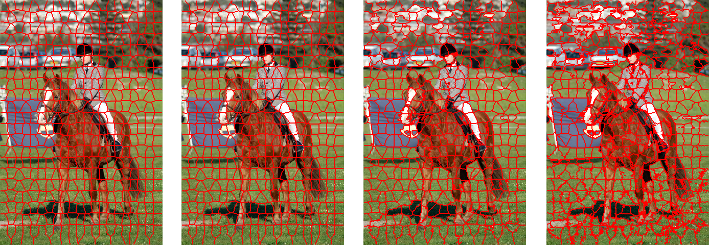
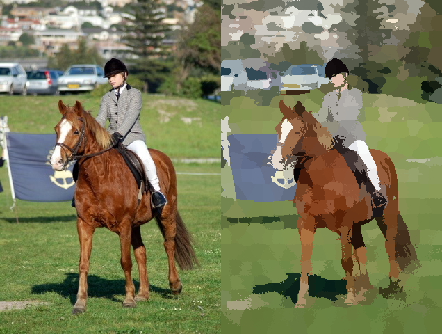
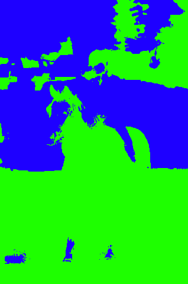

# SLIC 

Paper : [Link](https://core.ac.uk/download/pdf/147983593.pdf)

- Superpixel algorithm using simple iterative method
- Segmentation using Normalized Cut




Original Image (left side), Image by 400 Superpixels (right side) 



Bipartited image using Normalized Cut algorithm.


## Usage
```
chmod +x build.sh
./build.sh
./bin/SLIC <image path>
```

## Dependency

### C++17 (gcc >= 8.x)
### Opencv
```sudo apt install libopencv-dev```

## License
MIT License, 2023 @changdae20.